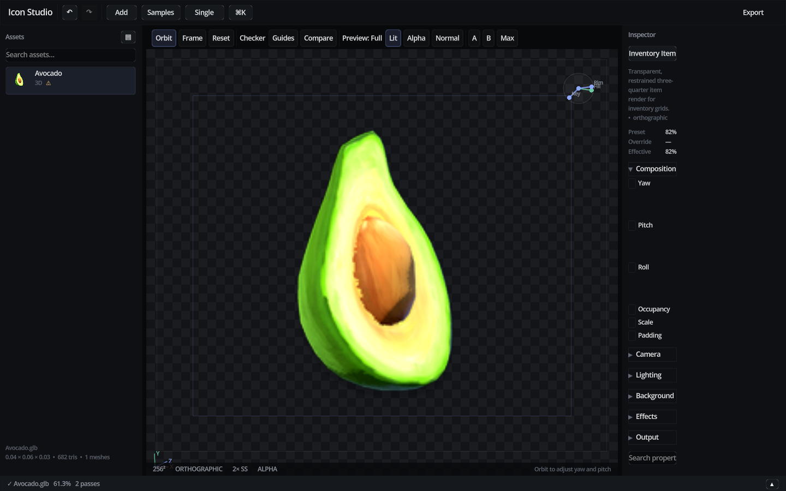

# Icon Forge

[](https://godotengine.org/)
[](#for-ai-agents)
[](LICENSE)
[](COMMERCIAL.md)
[](CONTRIBUTING.md)
[](#quality-gate)

**A deterministic, offline content service built for AI agents — with a human GUI on the same render core.**

Icon Forge turns GLB/glTF models and static images into production-ready PNG game imagery. It is designed so a **mediocre or imperfect AI agent** can specify *what* it wants (`inventory_icon`, `shop_thumbnail`, `npc_portrait`) and receive only:

1. **validated correct output**, or
2. **deterministically auto-corrected + validated output**, or
3. **`needs_review` / `failed`** with structured recovery guidance

Safe mode is designed so production-invalid outputs fail validation or are escalated for review rather than silently accepted.



## For AI agents

**Start here:**

| Document | Purpose |
|----------|---------|
| [AGENTS.md](AGENTS.md) | Canonical agent integration guide (read this first) |
| [docs/MACHINE_API.md](docs/MACHINE_API.md) | Semantic machine API contract |
| [docs/AI_WORKFLOW.md](docs/AI_WORKFLOW.md) | Step-by-step agent workflow |
| [examples/enigma_client.py](examples/enigma_client.py) | Minimal Python client wrapper |

**Normal agent request** — specify intent, not renderer internals:

```json
{
  "schema_version": 1,
  "operation": "render_asset",
  "asset": "fixtures/sword.gltf",
  "purpose": "inventory_icon"
}
```

```bash
./scripts/iconforge api --request examples/render_inventory.json --json
```

Discover everything from the tool itself:

```bash
./scripts/iconforge api --request <(echo '{"schema_version":1,"operation":"capabilities"}') --json
```

Agents should **not** normally send `yaw`, `pitch`, `fov`, `occupancy`, arbitrary output paths, or preset IDs. Icon Forge owns those decisions. See [docs/MACHINE_API.md](docs/MACHINE_API.md).

## Built for Enigma

This tool was extracted from the content pipeline for **Enigma**, my Godot 3D MMO project. Inventory grids, equipment previews, shop thumbnails, and portrait frames all need the same framing, lighting, and alpha behavior — Icon Forge is the shared render core that makes that repeatable for both **human artists and autonomous agents**.

The repo has **no runtime dependency** on the game itself: it ships as a standalone tool with its own machine API, CLI, presets, validation, and GUI. If you are building a Godot game with lots of item or character art, you can adopt Icon Forge without touching Enigma.

Related open tooling from the same ecosystem: [VFX Forge](https://github.com/Superlapie/VFXForgeEnigma) for real-time VFX authoring.

## Community project

Icon Forge is intentionally open. I want this to become a **badass community-built tool**, not a private pipeline script.

- **Good pull requests get reviewed.** See [CONTRIBUTING.md](CONTRIBUTING.md) for scope, quality gate expectations, and first-contribution ideas.
- **Discussions are open** for preset design, integration questions, and roadmap ideas: [GitHub Discussions](https://github.com/Superlapie/IconForgeEnigma/discussions).
- **Issues welcome** for reproducible bugs and focused feature requests.

If Icon Forge saves you time on your Godot project, a star, a preset contribution, or a docs fix helps others find it too.

## Launch

**AI agents / automation (recommended):**

```bash
./scripts/iconforge api --request examples/render_inventory.json --json
```

**Human GUI:**

```bash
./scripts/launch-gui
```

**Expert / legacy CLI** (debugging, humans, authorized tooling — not normal agent use):

```bash
./scripts/iconforge render fixtures/sword.gltf --preset weapon --output out/sword.png --force --json
```

The included `scripts/iconforge` wrapper uses a local Godot binary when present and uses `xvfb-run` for software OpenGL batch rendering on headless Linux machines. Set `ICONFORGE_GODOT` to use another Godot 4.x executable.

## What agents get

- **Semantic machine API** — `render_asset`, `render_asset_set`, `inspect_asset`, `validate_output`, `capabilities`, `schema`
- **Strict request validation** — unknown fields rejected; deterministic error codes with `recommended_action`
- **Purpose registry** — `inventory_icon`, `shop_thumbnail`, `equipment_preview`, portrait purposes, and more
- **Deterministic recipe resolution** — inspection morphology → internal preset (agent does not choose)
- **Bounded auto-correction** — finite framing passes; `needs_review` when contract cannot be met
- **Transactional output** — validate before commit; failed renders never overwrite valid artifacts
- **Idempotent job identity** — repeated identical requests reuse cached validated output
- **First-class manifests** — full audit trail at `generated/manifests/`
- **Filesystem safety** — safe mode writes only under `generated/`; path traversal rejected

## Included workflows

- GLB/glTF inspection and rendering through Godot’s native importer.
- PNG, JPEG, and WebP static-image fitting, background, outline, shadow, and resize workflow.
- Versioned JSON presets with `preset_revision` for reproducible production recipes.
- Auto-framing based on inspected AABB plus bounded rendered-silhouette correction.
- Asset-specific `<source_name>.icon.json` sidecars inherited by future safe-mode agent calls.
- GUI source list, drag-and-drop, preset picker, preview orbit/zoom, and PNG export (expert mode).

## Architecture

The project has no cloud service and no internal AI model. Its reusable core is:

```text
agent request → ApiService → inspect → resolve recipe → render → measure
→ bounded auto-correct → validate → commit → manifest
```

Both the machine API and GUI call the same shared `RenderService`. See [docs/ARCHITECTURE.md](docs/ARCHITECTURE.md) and [AGENTS.md](AGENTS.md).

## Quality gate

```bash
./scripts/quality-gate
```

It runs typed GDScript tests (including adversarial “dumb AI” API tests), validates all built-in presets, renders fixtures, runs machine API smoke tests, and completes real-model and GUI E2Es. Generated images are written under `out/` and `generated/` and are ignored by Git.

For production-oriented proof against real authored GLB assets:

```bash
./scripts/real-model-e2e
```

See [docs/REAL_MODEL_E2E.md](docs/REAL_MODEL_E2E.md) and [docs/GUI_E2E.md](docs/GUI_E2E.md).

## Documentation

**For AI agents (read these first):**

- [AGENTS.md](AGENTS.md) — canonical agent guide
- [Machine API](docs/MACHINE_API.md) — semantic request/response contract
- [AI workflow](docs/AI_WORKFLOW.md) — discover, render, recover from failures
- [Enigma client example](examples/enigma_client.py)

**For humans and expert tooling:**

- [Quickstart](docs/QUICKSTART.md)
- [CLI reference](docs/CLI_REFERENCE.md)
- [Preset reference](docs/PRESET_REFERENCE.md)
- [Architecture](docs/ARCHITECTURE.md)
- [Contributing](CONTRIBUTING.md)
- [Commercial licensing](COMMERCIAL.md)

## License

Icon Forge uses **dual licensing**:

- **Noncommercial use** — free under the [PolyForm Noncommercial License 1.0.0](LICENSE). You can read, fork, contribute, learn from, and use the project for personal, hobby, educational, and other noncommercial purposes.
- **Commercial use** — requires a separate paid license. See [COMMERCIAL.md](COMMERCIAL.md) for what counts as commercial use and how to contact me.

If you want to ship a commercial game, product, service, or client deliverable with Icon Forge in the pipeline, get a commercial license first.
